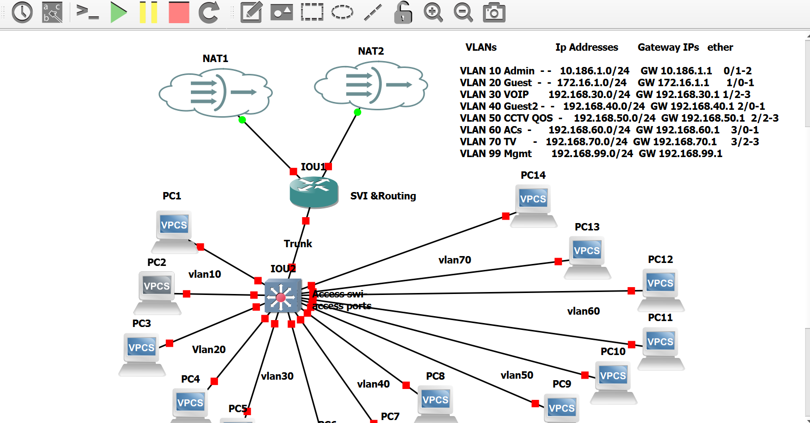

# My IT Infrastructure Lab Portfolio

This repository contains my hands-on IT infrastructure projects.

## Project Overview

This project demonstrates an enterprise network design and segmentation lab built using GNS3.

The lab focuses on creating a structured network environment with VLAN segmentation, Layer 3 routing, and secure communication between different network segments.

The goal of this project is to simulate a real-world enterprise network and practice network design, configuration, and troubleshooting.

## Projects

- Cisco networking labs
- VLAN configuration
- Routing and switching practice
- Network troubleshooting
- Server administration practice

## Network Design & Technologies Used

### Network Design

The lab implements an enterprise-style network with multiple VLANs to separate different departments and services.

Key network segments include:

- Guest Network VLAN
- Administration VLAN
- CCTV VLAN

### Technologies Used

- GNS3 for network simulation
- VMware Workstation for virtualization
- Cisco IOS devices for routing and switching
- ArubaOS-CX for enterprise switching
- VLANs for network segmentation
- Inter-VLAN routing using Layer 3 switching
- DHCP and IP addressing configuration
- ACLs for traffic control and security

## Network Topology 

## Configuration Highlights

The project includes hands-on configuration and troubleshooting of:

- VLAN creation and assignment
- Switch port configuration
- Layer 3 switching and inter-VLAN routing
- SVI configuration for VLAN gateways
- IP addressing and subnet design
- DHCP services
- Network connectivity testing using ping and troubleshooting commands
- Access Control Lists (ACLs) for traffic restriction and segmentation

## Skills Demonstrated

- Network design and documentation
- Cisco switching and routing
- Enterprise network segmentation
- Troubleshooting network connectivity issues
- Virtual lab deployment using GNS3 and VMware

- ## Future Improvements

Planned improvements for this lab include:

- Adding firewall configuration and security policies
- Implementing dynamic routing protocols
- Adding network monitoring and logging
- Expanding the topology with additional enterprise services
- Improving network documentation and diagrams

- 
## About Me

IT Support professional building hands-on experience in Network Engineering and Systems Administration through enterprise infrastructure labs and practical projects.

